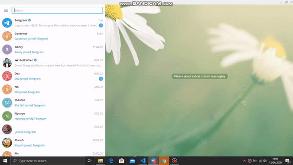

# Telegram_motivation_bot
> Building a telegram motivational bot that can be initialized on the command line(windows) / terminal(mac &amp; linux) where it sends    motivational messages to a specific user on his or her telegram account

 > This is a capstone project for the ruby curriculum at microverse coding school.

## Built With

- Ruby 2.6.5
- VS Code
- Telegram Bot API
- Type fit Quotes API
- Yo mamma Jokes API

## How to Install

- Install Ruby in your system. To install Ruby, you can read the [Documentation](https://www.ruby-lang.org/en/documentation/installation/)
- Download it as a [Zip File](https://github.com/peterrobert/Telegram_motivation_bolt.git). If you have installed Git in your system, you can clone it using **git clone** command.
- For Windows users, open Command Prompt and run:
    ```console
    C:\>cd TElEGRAM_MOTIVATIONAL_BOLT folder
    C:\TElEGRAM_MOTIVATIONAL_BOLT folder> run ruby bin/main.rb
    ```
- For Linux and Mac users, open a Terminal and run:
    ```console
    $ cd TElEGRAM_MOTIVATIONAL_BOLT folder
    $ run ruby bin/main.rb
    ``` 
- Navigate to your telegram account

- On your telegram account search for :
  ```
   @mawaitha_bot

   ``` 
- Then press the /START button and follow the steps given

     

## How to Test the Methods In the Classes


 Install Rspec gem in your system. To do this:

 Open Command Prompt or Terminal and run:

  ```console
  gem install Rspec
  ```

 Navigate into the spec folder and run the following at the console:

   ```console
   rspec telegram_bot_tests.rb
   ```

## Authors  

👤 **Peter Robert**

- Github: [@peterrobert](https://github.com/peterrobert)
- Twitter: [@ptahwambui93](https://twitter.com/Ptahwambui93)
- Linkedin: [Peter Robert Ndungu](https://www.linkedin.com/in/peter-rob-ndungu/)

## 🤝 Contributing

Contributions, issues and feature requests are welcome!. Feel free to check the [issues page](issues/).

## Show your support
